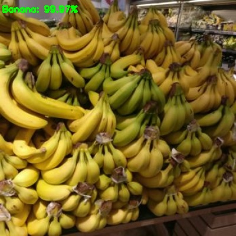
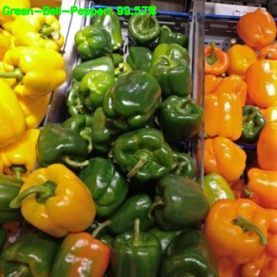

# Grocery Store Image Classification with Keras
This repository contains a classification with Keras and deep learning on [grocery store image dataset](https://github.com/marcusklasson/GroceryStoreDataset). This dataset not only contains a large volume of natural images but also includes the corresponding information. We reorganize the dataset because our aim is to build a simple classification model. Then we fine-tune the DenseNet-169 for 100 epochs on our dataset. 
## down the grocery store image dataset
It is available at https://github.com/marcusklasson/GroceryStoreDataset.
## build dataset
```
build_dataset ----dataset=/path to grocery store image dataset
```
The dataset consists of 5125 images from 81 classes.

## train
```
--dataset dataset --model output/activity.model --label-bin output/lb.pickle --plot output/plot.png --epochs 100
```
The classification accuracy from fine-tuned DenseNet-169 is 0.98.


## predict
```
--model output/activity.model --labels output/lb.pickle --image assets/pic/Granny-Smith.jpg
```
<p align="Center">
  
  
  
</p>
<p align="Center">
  
  
  
</p>

