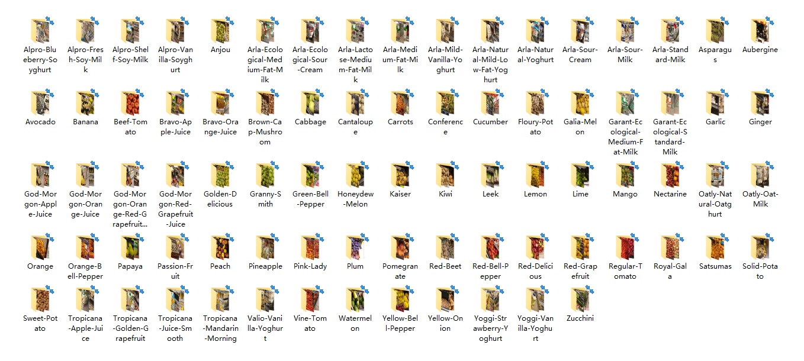
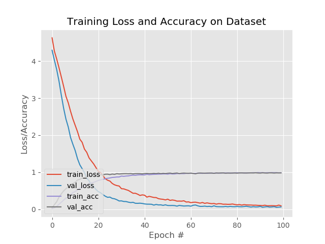
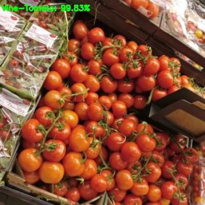
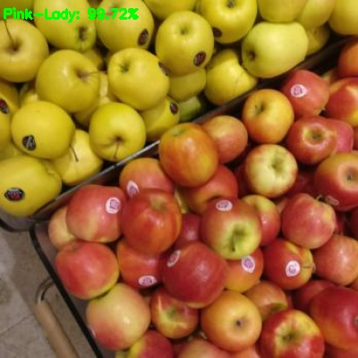

# Grocery Store Image classification with Keras
This repository contains a classification with Keras and deep learning on [grocery store image dataset](https://github.com/marcusklasson/GroceryStoreDataset). This dataset not only contains a large volume of natural images but also includes the corresponding information. We reorganize the dataset because our aim is to build a simple classification model。Then we fine-tune the DenseNet-169 for 100 epochs one our dataset. 
## data
Down the grocery store image dataset.It is available at https://github.com/marcusklasson/GroceryStoreDataset.
## build dataset
```
build_dataset ----dataset=/path to grocery store image dataset
```
There are 81.


## train
```
--dataset dataset --model output/activity.model --label-bin output/lb.pickle --plot output/plot.png --epochs 100
```


## predict
```
--model output/activity.model --labels output/lb.pickle --image assets/Granny-Smith.jpg
```
<p align="left">
  
  
</p>
<p align="left">
  
  
</p>

